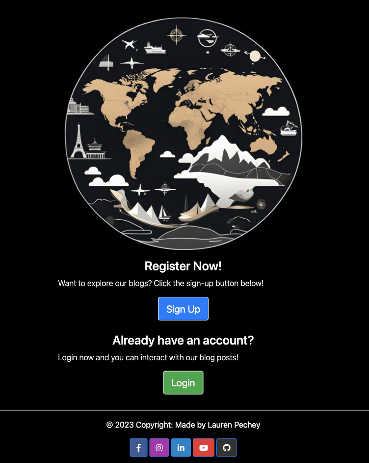
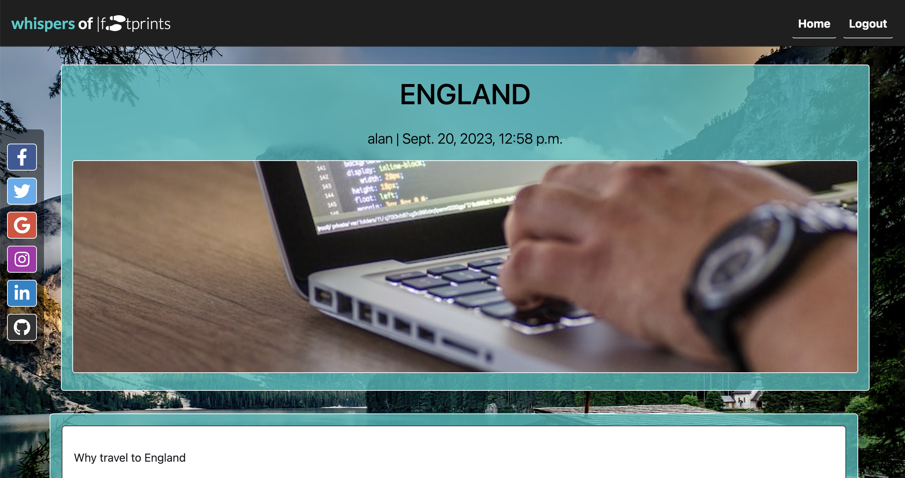

# Whispers of Footprints

#### By Lauren Pechey
[Click here to view the live web application](https://whispers-of-footprints-7b4c45535e12.herokuapp.com/)

#### TRAVELLERS!

This is the documentation for a my travel blog website: Whispers of Footprints! It has been built using the Django framework, Bootstrap version 4 for styling, as well as HTML5, CSS3, JavaScript and Python. This project was built as an educational Project as part of Code Institute’s Diploma in Full Stack Software Development, but may be used in future as a genuine travel blog for real-world clients. Please use the table of contents below to navigate through all of the planning, features, deployment, testing and more!

## Table of Contents

1. [Project Development and Planning](#project-development-and-planning)
    - [Project Goals](#project-goals)
        - [Project Purpose](#project-purpose)
        - [Client Goals](#client-goals)
        - [Target Audience](#target-audience)
        - [First Time User](#first-time-user)
        - [Registered User](#registered-user)
        - [Admin User](#admin-user)
        - [User Goals](#user-goals)
    - [Research](#research)
        - [Market Review](#market-review)
        - [Key Takeaways](#key-takeaways-from-market-review)
    - [User Stories](#user-stories)
    - [Content](#content)
    - [Design, Layout and Structure](#design-layout-and-structure)
        - [Wireframes](#wireframes)
        - [Structure and Layout](#structure-and-layout)
        - [Design and Colour](#design-and-colour)
        - [Font](#font)
2. [Technologies Used](#technologies-used)
    - [Languages](#languages)
    - [Tools](#tools)
3. [Features](#features)
    - [Future Features](#future-features)
4. [Deployment](#deployment)
5. [Credits](#credits)

## Project Development and Planning 

### Project Goals 

#### Project Purpose

The Whispers of Footprints travel blog was planned and developed using principles of User Experience (UX) design, which include the five planes of Strategy, Scope, Structure, Skeleton, and Surface. Using these principles, the aim was to create a fun, easy-to-use, responsive, and engaging travel that entertains users who are interested in travelling, blogging and sharing their travel experiences, and reading about others. The name "Whispers of Footprints" is an original name which was inspired by the idea of users writing (hence whispers) about their travels (or footprints).

#### Client Goals

Whispers of Footprints was built as a milestone project for my Diploma in Fullstack Software Development with [Code Institute](https://codeinstitute.net/global/full-stack-software-development-diploma/). It is an interactive travel blog designed to entertain users of all ages and backgrounds who want to read about different places in the world they can travel to, as well as write about their own. Despite this being built for educational reasons, it was still treated as a real-world application for potential clients interested in blogging about their travels in a fun, engaging way. Thus, this client's goals would be:

- Allowing users to read interesting travel blogs, which they can interact with through comments and likes
- Allowing users to write their own blogs about their travels, which they can post and share with their friends
- Ensuring easy, quick sign-up and login options so users can gain access to blog content quickly and do not lose interest
- Ensuring that the site is easy-to-navigate between posts
- Ensuring that the users can easily write about and publish their own blog posts

#### Agile Methodology

Agile Methodology was used to help prioritize and organize tasks, writting the user stories and using Project Boards on Github. Template was created to help write User Stories and define Epics

- Epics were written containing possible user stories and based on that the website was made.
- User stories were created by looking at epics and through iterations the project was advancing.
- Project Board is set to public.
- Project Board was used to track progression of the task through the Todo, In progress and Done columns
- Labels were added to sort the issues based on the importance.

#### Target Audience

- This travel blog is designed for users of any background or age, but will most likely gain more interest from those interested in travelling, learning more about other countries, or writing about their travels. 
- It is also likely to draw in users who are currently planning their own trip, or have already been on an interesting trip and would like to write about it and share it with their friends or family. 
- The organisation of the website makes it easy for adults, teenagers and even children to read and write about their travel experiences. Furthermore, they will be able to filter through the posts by category, which improves user experience and prevents users from having to find a post tied to their specific interests. 

#### First Time User

- Simple and intuitive website navigation, such as buttons and hamburger menus for easy exploration and discovery.
- Engaging visuals showcasing the beauty of different travel destinations.
- Informative content providing an About Us page which explains what the website offers.
- User-friendly forms with clear validation messages to ensure accurate input.
- Simple, easy registration process.

#### Registered User

- Seamless login process with a secure and personalized user account.
- Browsing blog posts for different destinations.
- Ability to like and comment on existing blog posts on the site.

#### Admin User

- Secure and separate login portal for admin users with appropriate access control.
- Access to an admin dashboard for managing cabins, amenities, and bookings.
- Ability to add, edit, or delete blog posts.
- Ability to approve or reject comments by users on blog posts.
- Ability to delete user accounts, providing the necessary control for managing user data and accounts.
- Ability to add or delete users.

#### User Goals 

The Whispers of Footprints aims to ensure that users can:

- Learn more about their personalities and how they would handle certain life scenarios
- Be entertained and engaged while taking a short quiz
- Navigate easily through the questions without interruptions
- See eye-catching results after answering all of the questions
- Retake the quiz as many times as they want to, to explore different results

### Research 

#### Market Review 

Before designing the website, I reviewed other travel blog websites (see below), in order to get a feel of how they presented themselves, which content and features they offered, and the design choices they made in terms of colour palette. I also reviewed what appeared to work well for the user and what needed improvements (see Key Takeaways). 

[Tailor Made Africa](https://www.tailormadeafrica.com/zimbabwe-safari/) | [Blog - Girlhood](https://www.girlmuseum.org/blog/?gclid=CjwKCAjw38SoBhB6EiwA8EQVLsQBKJg7uJXhmfld-1l3npYUCCWmactZPm8XVrFkZD3Wsl9YSyDh1hoCQ7IQAvD_BwE) | [Unspoken Smiles](https://unspokensmiles.org/blog/?gclid=CjwKCAjw38SoBhB6EiwA8EQVLiZ09Nrzm0248zLECMAWj3Xv5ZxIESixT3N_3SWB1dXJJbEhBctUchoCxdgQAvD_BwE) | [WordPress](https://wordpress.org/) | [Medium](https://medium.com/)

#### Key Takeaways

- The website should be eye-catching, with clear, enticing images to make users excited about reading and writing their own blogs
- The website should be clean, simple, and easy to navigate
- The sign up and login form should be quick and easy to fill in, to keep the user engaged and interested
- The home page should not be too busy, as this results in poor user experience and navigation
- The Write Your Own Section should be easy to use, to encourage users to write and publish their blogs
- There should be navigation buttons on each page, so the user does not need to use the back button on the web browser

### User Stories

As this would ideally be used in a real-world application, all user stories relate to a first-time, registered and admin user. 

As a first-time user, I would like to:
- see captivating images about different travel destinations
- have access to the about us page, to see what the website offers and how I can use it
- navigate easily through the site
- sign up quickly and easily
- access the site on any device

As a registered user, I would like to:
- login and logout quickly and easily
- navigate between pages quickly and easily
- read other user's blog posts to learn more about travel destinations
- like or unlike other people's blog posts
- comment on other people's blog posts

As an admin user, I would like to:
- Review comments from users to ensure all content it appropriate
- Create, read, edit or delete blog posts about different travel destinations
- Sign up and login easily with my admin password

These user stories gave me a clear scope for the website and enabled me to stay on track with the project, preventing issues like scope creep at a later stage after the coding process. 

### Design, Layout and Structure 

The Whispers of Footprints website boasts an inviting and visually pleasing design. With the theme of travelling in mind, ocean colours of light blues and greens were used to evoke a sense of tranquility. The navigation bar features a footprints logo and easy-to-read text. Captivating photos are displayed in a bordered carousel with elegant captions to invite the user to use the site. The about section utilizes bright ocean colours which contrast with a grey background to make the text legible and clear. Social media links are presented in the footer, and the footer compliments the overall design.

#### Wireframes

I used [Figma](https://figma.com/) in the initial design phase, before the coding process. This enabled me to develop the website's structure, skeleton, layout and overall look and style. I created designs for desktop, tablet and mobile screens to ensure that responsiveness was at the forefront of the application from the beginning.

Screenshots

_Desktop Wireframes_

_iPad Wireframes_

_Phone Wireframes_

#### Structure and Layout

The structure of this website was informed by the scope, principles of interactive design (IXD), as well as the user goals of the site. Keeping these important concepts in mind ensured that the website conformed to the user's expectations and needs. 

The main site is a simple, single-page website with content displayed and hidden at different points in the site using JavaScript code. There are three main sections within the page which appear and disappear depending on which button the user clicks. These are:

- The Home Page: a carousel of images and buttons to navigate the user to the about us page and blog section
- The About Us page: explains what the website offers and why the user should use our site
- The Blog Post page: shows the user a catalogue of blog posts that they can click on and read

There is also a sign up, login and logout page for easy access and navigation. 

There is also a 404 page for when a user lands on a non-existent page with a button to link back to the home page.

#### Design and Colour

This site was designed using a mobile-first approach, because after conducting some research (using sites like [Adobe](https://xd.adobe.com/ideas/process/ui-design/what-is-mobile-first-design/)), it appears that most users use their mobile devices over desktop or iPad screens. 

- The design was influenced by travel-inspired colours like shades of blue and green which contrast well with the grey dark theme, and allow for good legibility. 
- The welcome page has images of different travel destinations, to encourage the user to continue using the site.
- I used the same border-radius for all buttons and options to give maintain consistency throughout the site. 

#### Font

My choice of font was Bootstrap's built-in [Helvetica Neue](https://www.w3schools.com/bootstrap4/bootstrap_typography.asp#:~:text=The%20default%20font%2Dfamily%20is,%2C%20Arial%2C%20sans%2Dserif.). The light font was used for all paragraphs and and the bold font was used for all headings and buttons. I chose this font for my website because it provided a professional, legible finish.

#### Travel Carousel Images

All images were taken from [Pexels](https://www.pexels.com/), and were centered around the theme of travel with different destinations in mind. 

#### Logo

The Logo was also created using AI image generator [Craiyon](https://www.craiyon.com/).

### Data Models

1. AllAuth User Model
    * Django Allauth, the User model is the default user model provided by the Django authentication system.
    * The User entity has a one-to-many relationship with the commenting entity. This means that a User's comment will be read by many other users, and the user can like and comment on many blogs. 
---
2. Blog Post Model
    * Data model created so admin can create, read, update and delete any blog posts about travel destinations.
    * Only Admin can change the data in the backend.
    * Only Admin can approve or reject comments on blog posts by users. 
---
3. Comment and Like Model
    * Users can comment on any blog post, and like any posts.
    * The User entity has a one-to-many relationship with the commenting entity. This means that a User's comment will be read by many other users, and the user can like and comment on many blogs. 
    * Only Admin can approve or reject comments on blog posts by users. 
    * Users can see the comments once it has been approved by admin.
    * Users can see how many likes are on each blog post.
    * Users can see how many comments are on each blog post.

4. Comment Update & Delete Models

    * Users can update and delete their comments, only after the admin has approved of their comments. 
    * The delete model provides validation to the user so their comment does not delete without a warning first. 

### User Journey 

### Database Scheme

Entity Relationship Diagram (ERD)

## Security Features

### User Authentication

* Django Allauth is a popular authentication and authorization library for Django, which provides a set of features for managing user authentication, registration, and account management.

### Login Decorator

* This ensures that only authenticated users can access the views available, and require authentication with the login_required decorator.

### CSRF Protection

* Django provides built-in protection against Cross-Site Request Forgery (CSRF) attacks. CSRF tokens are generated for each user session, and they are required to submit forms or perform state-changing actions. When a user logs out, the session and associated CSRF token are invalidated, making it difficult for an attacker to forge a valid request using a copied URL.

### Admin approval

* Users cannot comment without approval from the admin site, preventing users from writing derogatory or offensive comments.

### Custom error pages

* 404 Error Page, provides user with a button the redirect to home page.
* 500 Error Page, provides user with a button the redirect to home page.

## Features 

### Existing Features

#### Home Page

* Displays a navigation bar with a logo, carousel with eye-catching images, buttons to navigate to different sections of the website, social media sidebar icons and a footer with information and a copyright logo. 

Screenshots

_Desktop_

_iPad_

_Phone_

_Logo_

_Social Media Sidebar_

_Hamburger menu on small and medium screens_

#### Navigation Bar

The navigation bar features on every page. When the user has not registered, the navbar shows the signup and login buttons, and once they have logged in successfully, those buttons disappear and display only the logout button. 

Screenshots

_Navbar before login_

_Navbar after login_

#### About Us Section

The About Us section gives the user information about the blog site, and how they will benefit if they use the site. This page is initially hidden, until the user clicks the "Learn About Us" button. The information is displayed on flipcards, which rotate when the user clicks the "Learn more" button.

Screenshots

_About Us Page_

_Flipcards with information_

#### Sign Up, Login & Logout sections

The site has a sign up, login and logout form, all with password validation from django's built-in allauth features. They were all styled similarly for consistency.

Screenshots

_Sign Up Page_

_Login Page_

_Logout Page_

#### Explore Our Blogs (pagination) section

This section displays a catalogue of blog cards, with the title, author and date written of the blog post. If the user wants to read the blog, they simply have to click on the card and will be taken to the Blog Post Details page. This page was made responsive on all screens, using bootstrap's responsive classes. 

Screenshots

_Paginated Blog Page_

_Phone view_

#### Blog Details section

Here, the user can see the blog posts in full, with the Blog Title, image of the trip, and information about the destination they are interested in.

Screenshots

_Blog Detail Page_

_Phone View_

#### Comments, Likes, Update and Delete options

Here CRUD (Create, Read, Update and Delete) was implemented. The user can create a comment, read other people's comments, update their comment and delete their comment. 

Screenshots

_Comment Box on Desktop_

_Phone View_

_Number of likes and comments_

#### Admin Features

* Django built in admin panel allows admin control over the website.
* Admin can access admin panel through his navigation bar.
* Can add, update, delete comments, likes and blog posts.
* View, Edit and Delete User accounts.

#### Error Pages

### Future Features

* User Reviews: Allow users to leave reviews and ratings for blogs they have read, providing valuable feedback for other users.
* Advanced Search: Implement an advanced search functionality, enabling users to search for blogs based on specific criteria such as location, title or date.
* Create your own Blog: Users can write and publish their own blogs, rather than reading published posts by admin. 

For the purposes of this project these implemenation were not within the right scope.

## Technologies Used

### Languages Used

* [HTML5](https://en.wikipedia.org/wiki/HTML5)
* [CSS3](https://en.wikipedia.org/wiki/CSS)
* [JavaScript](https://en.wikipedia.org/wiki/JavaScript)
* [Python](https://en.wikipedia.org/wiki/Python_(programming_language))

### Databases Used

* [ElephantSQL](https://www.elephantsql.com/) - Postgres database
* [Cloudinary](https://cloudinary.com/) - Online static file storage

### Frameworks Used

* [Django](https://www.djangoproject.com/) - Python framework
* [Bootstrap 4.6.1](https://getbootstrap.com/docs/4.6/getting-started/introduction/) - CSS framework

### Programs Used

* [Github](https://github.com/) - Storing the code online
* [Gitpod](https://www.gitpod.io/) - To write the code.
* [Heroku](https://www.heroku.com/) - Used as the cloud-based platform to deploy the site.
* [Google Fonts](https://fonts.google.com/) - Import main font the website.
* [Figma](https://www.figma.com/) - Used to create wireframes and schemes
* [Craiyon](https://www.craiyon.com/) - Generate AI images of cabins and logo based on my words descriptions
* [Am I Responsive](https://ui.dev/amiresponsive) - To show the website image on a range of devices.
* [Git](https://git-scm.com/) - Version control
* [Favicon Generator](https://realfavicongenerator.net/) - Used to create a favicon
* [JSHint](https://jshint.com/) - Used to validate JavaScript
* [W3C Markup Validation Service](https://validator.w3.org/) - Used to validate HTML
* [CSS Validation Service](https://jigsaw.w3.org/css-validator/) - Used to validate CSS
* [CI Python Linter](https://pep8ci.herokuapp.com/#) - Used to validate Python
* [Colormind](http://colormind.io/) - Color Scheme

## Testing
Please see  [TESTING.md](TESTING.md) for all the detailed testing performed.

## Deployment and Local Developement

Live deployment can be found on this [View Whispers of Footprints live website here](LINK)

### Local Developement

#### How to Fork

1. Log in (or Sign Up) to Github.
2. Go to the repository for this project [Whispers of Footprints](https://github.com/pecheylauren02/mp4-travel-blog).
3. Click the fork button in the top right corner to fork the repository.

#### How to Clone

1. Log in(or Sign Up) to Github.
2. Go to repository for this project [Whispers of Footprints](https://github.com/pecheylauren02/mp4-travel-blog).
3. Click on the code button, select whether you would like to clone with HTTPS, SSH or GitHub CLI and copy the link shown.
4. Open the terminal in your code editor and change the current working directory to the location you want to use for the cloned directory.
5. Type the following command in the terminal (after the git clone you will need to paste the link you copied in step 3 above).
6. Set up a virtual environment (this step is not required if you are using the Code Institute Template in GitPod as this will already be set up for you).
7. Install the packages from the requirements.txt file - run Command pip3 install -r requirements.txt

### ElephantSQL Database

[Whispers of Footprints](https://github.com/pecheylauren02/mp4-travel-blog) is using [ElephantSQL](https://www.elephantsql.com/) PostgreSQL Database.

1. Click Create New Instance to start a new database.
2. Provide a name (this is commonly the name of the project: tribe).
3. Select the Tiny Turtle (Free) plan.
4. You can leave the Tags blank.
5. Select the Region and Data Center closest to you.
6. Once created, click on the new database name, where you can view the database URL and Password.

### Cloudinary

[Whispers of Footprints](https://github.com/pecheylauren02/mp4-travel-blog) is using [Cloudinary](https://cloudinary.com/):
1. For Primary interest, you can choose Programmable Media for image and video API.
2. Optional: edit your assigned cloud name to something more memorable.
3. On your Cloudinary Dashboard, you can copy your API Environment Variable.
4. Be sure to remove the CLOUDINARY_URL= as part of the API value; this is the key.

### Heroku Deployment

* Log into [Heroku](https://www.heroku.com/) account or create an account.
* Click the "New" button at the top right corner and select "Create New App".
* Enter a unique application name
* Select your region
* Click "Create App"

#### Prepare enviroment and settings.py
* In your GitPod workspace, create an env.py file in the main directory.
* Add the DATABASE_URL value and your chosen SECRET_KEY value to the env.py file.
* Update the settings.py file to import the env.py file and add the SECRETKEY and DATABASE_URL file paths.
* Comment out the default database configuration.
* Save all files and make migrations.
* Add the Cloudinary URL to env.py
* Add the Cloudinary libraries to the list of installed apps.
* Add the STATIC files settings - the url, storage path, directory path, root path, media url and default file storage path.
* Link the file to the templates directory in Heroku.
* Change the templates directory to TEMPLATES_DIR
* Add Heroku to the ALLOWED_HOSTS list the format ['app_name.heroku.com', 'localhost']

#### Add the following Config Vars in Heroku:

* SECRET_KEY - This can be any Django random secret key
* CLOUDINARY_URL - Insert your own Cloudinary API key
* PORT = 8000
* DISABLE_COLLECTSTATIC = 1 - this is temporary, and can be removed for the final deployment
* DATABASE_URL - Insert your own ElephantSQL database URL here

#### Additional requirements

Heroku needs two additional files to deploy properly
* requirements.txt
* Procfile

#### Final Deployment

1. Make sure DEBUG = False in the settings.py
2. Go to the deploy tab on Heroku and connect to GitHub, then to the required repository.
3. Scroll to the bottom of the deploy page and either click Enable Automatic Deploys for automatic deploys or Deploy Branch to deploy manually. Manually deployed branches will need re-deploying each time the GitHub repository is updated.
4. Click 'Open App' to view the deployed live site.

Site is now live

## Credits

### Docs and Code

[Stack Overflow](https://stackoverflow.com/)
[Code Institute](https://learn.codeinstitute.net/dashboard)
[Bootstrap 4.6](https://getbootstrap.com/docs/4.6/getting-started/introduction/)
[Django docs](https://docs.djangoproject.com/en/4.2/)
[Django Allauth](https://django-allauth.readthedocs.io/en/latest/)
[Django and Static Assets](https://docs.djangoproject.com/en/4.2/howto/static-files/)
[Cloudinary](https://cloudinary.com/)

### Content and Images

All of the content written in the about us sections and home page is imaginary and written by the developer, Lauren Pechey.
All images were either taken from [Pexels](https://www.pexels.com) or generated with Artificial intelligence (AI) [Craiyon](https://www.craiyon.com/) based on word input and description of the cabins and logo.

## Acknowledgments

* I would like to thank my mentor for support and feedback throughout this project, Rohit Sharma.
* I would also like to extend my appreciation to the Slack community for their continuous engagement and willingness to share knowledge. The collaborative environment provided a platform for learning, troubleshooting, and gaining inspiration from fellow developers.