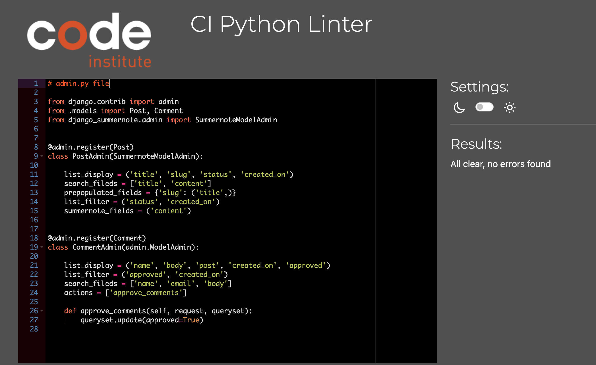
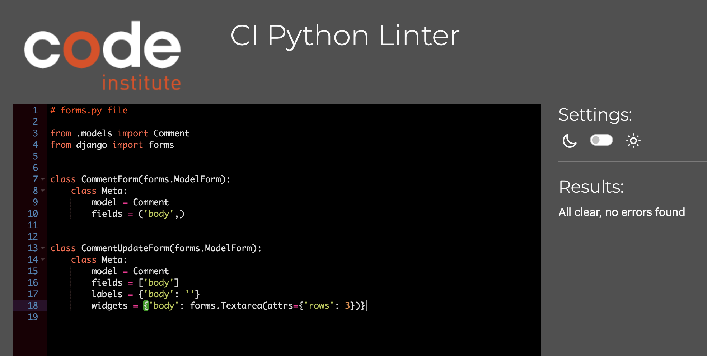
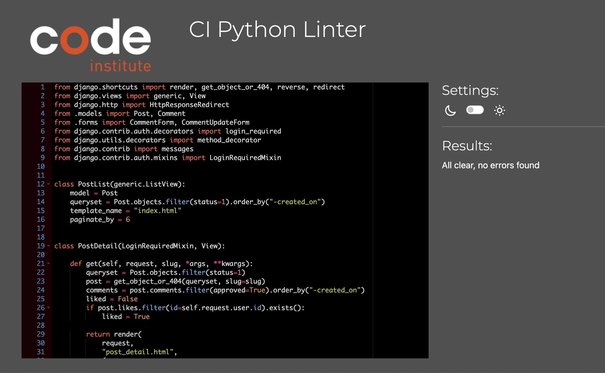
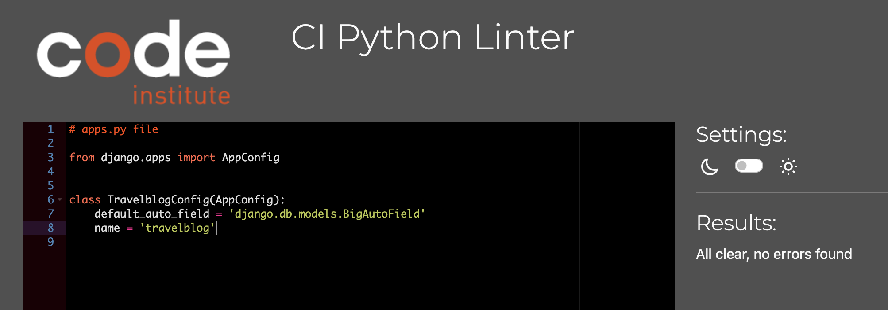
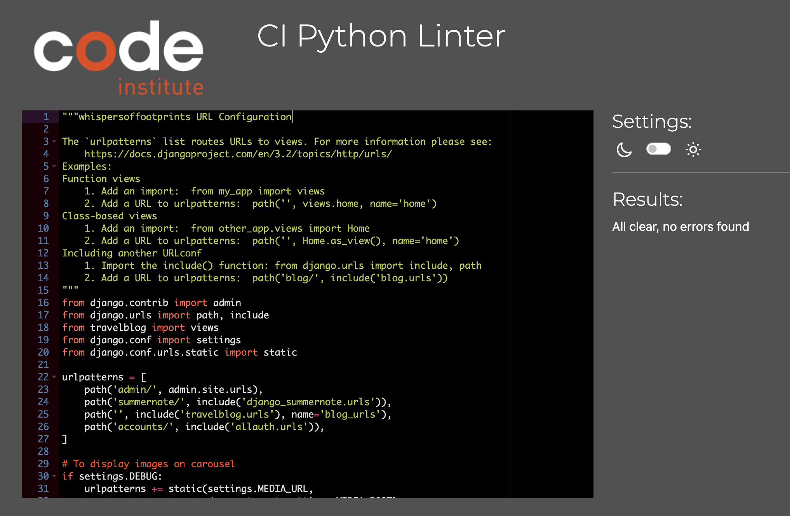
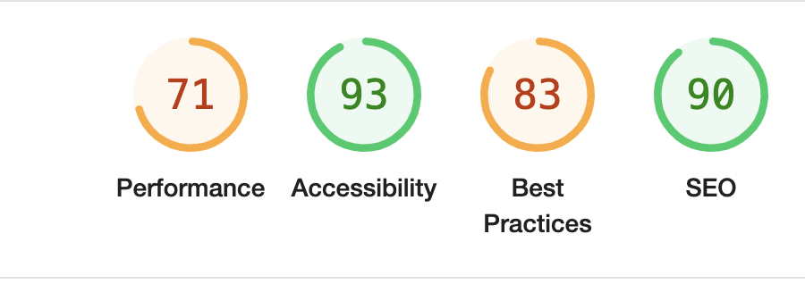

# Whispers of Footprints | Testing

Return to [README](README.md)
- - -

Comprehensive testing has been performed to ensure the website's seamless and optimal functionality.

## Table of Contents
### [Responsiveness Testing](#responsiveness-testing-1)
### [Browser Compatibility Testing](#browser-compatibility-testing-1)
### [Device Testing](#device-testing-1)
### [Code Validation](#code-validation-1)
* [HTML Validation](#html-validation)
* [CSS Validation](#css-validation)
* [JavaScript Validation](#javascript-validation)
* [Python](#python)
### [Lighthouse Report](#lighthouse-report-1)
### [Bugs](#bugs-1)
* [Resolved Bugs](#resolved-bugs)
### [Features Testing](#features-testing-1)
---

## Responsiveness Testing

The deployed website underwent rigorous testing on multiple devices and screen sizes to ensure its responsiveness and adaptability. Developer Tools were utilized to simulate various screen sizes, enabling thorough examination of how the website behaves across different devices. Bootstrap classes and media queries were implemented to achieve the desired design, ensuring that the website maintains its visual and functional integrity on all platforms, enhancing the user experience.

Desktop PC

Tablet/iPad

Phone

## Browser Compatibility Testing

The project was tested on multiple web browsers to check for compatibility issues and ensure it functions as expected across all of them. This testing process guarantees a smooth and consistent user experience, regardless of the browser used.

Browers tested were:
* Chrome
* Microsoft Edge
* Opera
* Safari
* Mozilla Firefox

All tests cleared for different browsers. 

## Device Testing

Device testing was conducted on a variety of phone models, including Samsung Galaxy S10, iPhone 12, Huawei, OneNote Plus, MacBook Pro 13-inch. The assistance of family members and friends was sought to perform the testing. This comprehensive approach ensured that the website was thoroughly evaluated on different devices and platforms, contributing to a more robust and user-friendly final product.

## Code Validation

### HTML Validation

HTML was tested using the [W3C HTML Validator Testing site](https://validator.w3.org/). No errors emerged. 

HTML Validation Result

 

### CSS Validation

CSS was tested using the [W3C HTML Validator Testing site](https://validator.w3.org/). No errors emerged. 

CSS Validation Result

 

### JavaScript Validation

JS Validation Result

 
 
 

### Python PEP8

#### travelblog App

All tests were conducted using Code Institute's built-in [PEP8](https://pep8ci.herokuapp.com/). All tests cleared with no errors. 

 admin.py

 forms.py

 models.py

 views.py

 apps.py

 urls.py

#### whispersoffootprints App

 urls.py

## Lighthouse Report

Lighthouse was used to check the performance, SEO, best practices and accessibility. SEO, best practices and accessibility scored high. Performance was high, but for future purposes, images will be resized to improve the score even more. 

Lighthouse results

## Bugs

### Resolved Bugs

#### Favicon and Images not displaying after deployment

* When the site was deployed to Heroku for the first time, the custom CSS was not working. It was due to Cloudinary not providing the static files. After changing DEBUG = True to DEBUG = False, and putting only the original cloudinary urls into the style.css file, it worked. 

## Features Testing
 
| Page          | User Action   | Expected Result  | Notes            |
|---------------|---------------|------------------|------------------|
| Home Page     |               |                  |                  |
|               | Click on Logo | Redirect to Home Page | PASS        |
|               | Click on Sign Up button | Redirect to Sign Up page | PASS |
|               | Click on Sign Up button (Navigation bar) | Redirect to Sign Up page | PASS |
|               | Click on About Us (Navigation bar) | Move to about section | PASS |
|               | Click on carousel control | Move left, move right | PASS |
|               | Click on social links in footer | Open new tab with appropriate link | PASS |
|               | Click on Login (Navigation bar) | Redirect to Login page | PASS |
| Home Page (Logged In - User)  |                 |          |  |
|               | After Login | Sign Up button is now gone | PASS |
|               | Click on About Us | Redirect to about us page | PASS |
|               | Click on carousel | Carousel slides through images | PASS |
|               | After Login | Logout button displays | PASS |
|               | Click on Explore Our Blogs | Redirect to Blogs Pagination page | PASS |
|               | Click on Logout | Redirect to Logout Page | PASS |
| Home Page (Logged In - Admin)    |               |                  |                  |
|               | Click on admin name | Open dropdown menu | PASS |
|               | Click on Home | Redirect to Home page | PASS |
|               | Click on Admin Panel | Redirect to Django Admin Panel | PASS |
| Sign Up Page  |                  |                  |                  |
|               | Enter invalid email | Field will only accept email address format | PASS |
|               | Enter valid email | No error | PASS |
|               | Email field left empty | Email is optional | PASS |
|               | Type invalid password | Must contain atleast 8 char | PASS |
|               | Type valid password | No error | PASS |
|               | Type password again (different) | Password must be the same | PASS |
|               | Click Sign Up with empty form | Fill in the form fields | PASS |
|               | Click Sign In if you have an account | Redirect to Login page | PASS |
|               | Fill all the form fields | Account created, alert message that you Signed in | PASS |
| Login Page    |                  |                  |                  |
|               | Click on Sign Up, if you don't have an account | Redirect to Sign Up page | PASS |
|               | Try invalid username | Username is not correct | PASS |
|               | Try invalid password | Password is not correct | PASS |
|               | Valid password and username | Logs in, message that you signed in | PASS |
|               | Click Sign In with empty form | Fill in the form fields | PASS |
| Logout Page   |                  |                  |                  |
|               | Click on Sign Out button | Sign user out, message that user signed out | PASS |
| Blog Page     |                  |                  |                  |
|               | Click on Blog | Redirect to Blog Post Detail page | PASS |
| Blog Detail   |                  |                  |                  |
|               | Click on like button | Number of likes increases | PASS |
|               | Add Comment | Comment approval message appears | PASS |
|               | Update Comment | Redirect to Update page, comment updates after submit | PASS |
|               | Delete Comment | Redirect to Delete page, comment deletes after submit | PASS |
| Admin Panel   |  |    |    |
|               | CRUD functionality | Working as expected | PASS |

Return to [README](README.md)
