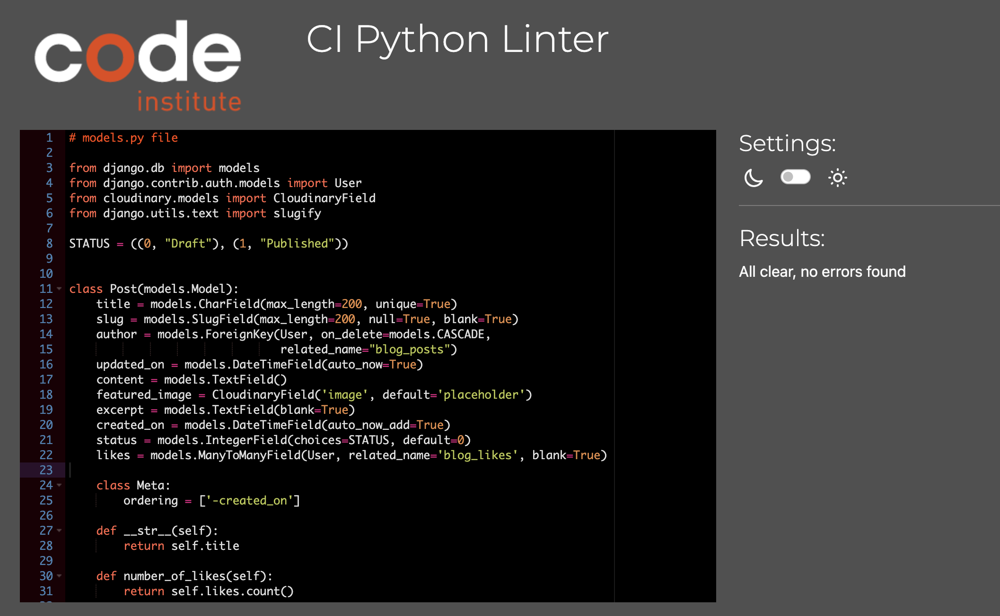
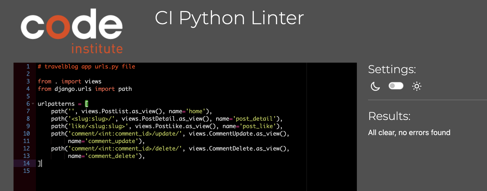

# Whispers of Footprints | Testing

Return to [README](README.md)
- - -

Comprehensive testing has been performed to ensure the website's seamless and optimal functionality.

## Table of Contents
### [Responsiveness Testing](#responsiveness-testing-1)
### [Browser Compatibility Testing](#browser-compatibility-testing-1)
### [Device Testing](#device-testing-1)
### [Code Validation](#code-validation-1)
* [HTML Validation](#html-validation)
* [CSS Validation](#css-validation)
* [JavaScript Validation](#javascript-validation)
* [Python](#python)
### [Lighthouse Report](#lighthouse-report-1)
### [Bugs](#bugs-1)
* [Resolved Bugs](#resolved-bugs)
* [Unresolved Bugs](#unresolved-bug)
### [Features Testing](#features-testing-1)
---

## Responsiveness Testing

The deployed website underwent rigorous testing on multiple devices and screen sizes to ensure its responsiveness and adaptability. Developer Tools were utilized to simulate various screen sizes, enabling thorough examination of how the website behaves across different devices. Bootstrap classes and media queries were implemented to achieve the desired design, ensuring that the website maintains its visual and functional integrity on all platforms, enhancing the user experience.

Desktop PC

Tablet/iPad

Phone

## Browser Compatibility Testing

The project was tested on multiple web browsers to check for compatibility issues and ensure it functions as expected across all of them. This testing process guarantees a smooth and consistent user experience, regardless of the browser used.

Browers tested were:
* Chrome
* Microsoft Edge
* Opera
* Safari
* Mozilla Firefox

All tests cleared for different browsers. 

## Device Testing

Device testing was conducted on a variety of phone models, including Samsung Galaxy S10, iPhone 12, Huawei, OneNote Plus, MacBook Pro 13-inch. The assistance of family members and friends was sought to perform the testing. This comprehensive approach ensured that the website was thoroughly evaluated on different devices and platforms, contributing to a more robust and user-friendly final product.

## Code Validation

### HTML Validation

HTML was tested using the [W3C HTML Validator Testing site](https://validator.w3.org/). No errors emerged. 

HTML Validation Result

 

### CSS Validation

CSS was tested using the [W3C HTML Validator Testing site](https://validator.w3.org/). No errors emerged. 

CSS Validation Result

 

### JavaScript Validation

CSS Validation Result

 

### Python PEP8

#### travelblog App

All tests were conducted using Code Institute's built-in [PEP8](https://pep8ci.herokuapp.com/). All tests cleared with no errors. 

 admin.py

 forms.py

 models.py

 views.py

 apps.py

 urls.py

#### whispersoffootprints App

 urls.py

## Lighthouse Report

Lighthouse was used to check the performance, SEO, best practices and accessibility. SEO, best practices and accessibility scored high. Performance was high, but for future purposes, images will be resized to improve the score even more. 

Lighthouse results

## Bugs

### Resolved Bugs

#### Refused to apply style from Woodland Whispers site link because its MIME type(text/html).

* When I have deployed the site to Heroku for the first time, my custom CSS was not working, it was due to Cloudinary not providing my static files, I had to change my DEBUG = True to DEBUG = development, development = os.environ.get('DEVELOPMENT'), which is connected to my Gitpod variable DEVELOPMENT  which is set to True, meaning deployed site is set to False and production is set to True, I had to delete my static files from Cloudinary and force a manual deploy again and it picked up the files and everything works since then.

#### Flatpick not reloading

 * Page is reloaded by ensuring the bookedDates array is correctly populated with booked dates before initializing the flatpickr date picker. This is achieved by checking if the booked_dates_json variable is truthy, parsing it as JSON, and using the resulting array for flatpickr's disable option. The DOMContentLoaded event listener guarantees proper timing for the flatpickr initialization.

#### Specified Value 'None'

* Fixed a bug in edit_booking template, if user didin't book amenities when user would go to edit his booking, in console log there was a message statin 'The specified value 'None' cannot be parsed or is out of range, that is because if amenities was left empty it would have value None instead of intended 0 value. That was fixed by adding a default_if_none:'0' to make sure if amenities were left empty the form isself would apply 0 value to them and removing the issue.

### Unresolved Bug

#### Flatpick activates after booking is made on some phone devices

* It's possible that the bug is related to the mobile environment or specific device configurations

* On certain mobile devices, the Flatpickr calendar component doesn't activate until a cabin has been booked by any user yet. Prior to any bookings, the calendar displays a standard design instead of the expected Flatpickr layout. However, rest assured, this issue has no adverse impact on the user experience. The discrepancy in appearance is merely temporary and limited to the initial state until a booking is made. Once a cabin is reserved, Flatpickr seamlessly takes over, providing the intended functionality.

* It means if the cabin hasn't been booked by anyone this might make some phones use a standard calendar until the first booking is made, after that it works as expected and has no negative impact on the user experience.

## Features Testing
 
| Page          | User Action   | Expected Result  | Notes            |
|---------------|---------------|------------------|------------------|
| Home Page     |               |                  |                  |
|               | Click on Logo | Redirect to Home Page | PASS        |
|               | Click on Sign Up button | Redirect to Sign Up page | PASS |
|               | Click on Sign Up button (Navigation bar) | Redirect to Sign Up page | PASS |
|               | Click on About (Navigation bar) | Move to about section | PASS |
|               | Click on carousel | Redirect to sign up page | PASS |
|               | Click on carousel control | Move left, move right | PASS |
|               | Click on social links in footer | Open new tab with appropriate link | PASS |
|               | Click on Contact (Navigation bar) | Redirect to Contact page | PASS |
|               | Click on Login (Navigation bar) | Redirect to Login page | PASS |
| Home Page (Logged In - User)  |                 |          |  |
|               | After Login | Sign Up button is now Book Now button | PASS |
|               | Click on Book Now | Redirect to browse cabins | PASS |
|               | Click on carousel | Redirects to browse cabins | PASS |
|               | After Login | Users name is displayed in navigation bar | PASS |
|               | Click on users name | Open dropdown menu | PASS |
|               | Click on My Booking in dropdown | Redirect to Booking Overview page | PASS |
|               | Click on Make a Booking in dropdown | Redirect to browse cabins | PASS |
|               | Click on Logout | Redirect to Logout Page | PASS |
| Home Page (Logged In - Admin)    |               |                  |                  |
|               | Click on admin name | Open dropdown menu | PASS |
|               | Click on My Booking in dropdown | Redirect to Booking Overview page | PASS |
|               | Click on Admin Panel | Redirect to Django Admin Panel | PASS |
| Contact Page     |               |                  |                  |
|               | Click on social links | Open new tab with appropriate link | PASS |
| Sign Up Page  |                  |                  |                  |
|               | Enter invalid email | Field will only accept email address format | PASS |
|               | Enter valid email | No error | PASS |
|               | Email field left empty | Email is optional | PASS |
|               | Type invalid password | Must contain atleast 8 char | PASS |
|               | Type valid password | No error | PASS |
|               | Type password again (different) | Password must be the same | PASS |
|               | Click Sign Up with empty form | Fill in the form fields | PASS |
|               | Click Sign In if you have an account | Redirect to Login page | PASS |
|               | Fill all the form fields | Account created, alert message that you Signed in | PASS |
| Login Page  |                  |                  |                  |
|               | Click on Sign Up, if you don't have an account | Redirect to Sign Up page | PASS |
|               | Try invalid username | Username is not correct | PASS |
|               | Try invalid password | Password is not correct | PASS |
|               | Valid password and username | Logs in, message that you signed in | PASS |
|               | Click Sign In with empty form | Fill in the form fields | PASS |
| Logout Page  |                  |                  |                  |
|               | Click on Sign Out button | Sign user out, message that user signed out | PASS |
| Browse Cabins Page  |                  |                  |                  |
|               | Click on Book Now on any Cabin | Redirects to selected cabin booking form | PASS |
|               | Click on Next button | Moves to another page, displays different cabins | PASS |
|               | Click on Previous button | Goes back to previous page | PASS |
| Make a Booking Page  |                  |                  |                  |
|               | Click on Book Now button while form is empty | Fill in the form fields, alert message | PASS |
|               | Try to select dates in the past | They are disabled | PASS |
|               | Try to select already booked dates | They are disabled, unavailable until dates become available is someone deletes their booking         | PASS |
|               | Try to overlap your booking around the already booked dates | Cabins already booked for those dates, alert message | PASS |
|               | Input more guests than maximum guests | Can't exceed maximum guests, alert message | PASS |
|               | Input 0 or less than 0 guests | Guests can't be less than 0, alert message | PASS |
|               | Input more tickets than number of guests | Can't buy more tickets than number of guests | PASS |
|               | Input less than 0 tickets | Can't select less than 0 tickets, alert message | PASS |
|               | Input less than 0 kayaks | Can't select less than 0 kayaks, alert message | PASS |
|               | Input 0 kayaks | kayaks are optional, no error | PASS |
|               | Input 0 tickets | tickets are optional, no error | PASS |
|               | maximum kayak rental is 10 | Anything over 10 throws an error, alert message | PASS |
|               | Try to make check out date be before check in date | Check out can't be before check in, alert message | PASS |
|               | Enter valid form data | Booking Succesful, alert message and a total price is calculated based on the booking | PASS |
|               | User fills in only check in, check out and num of guests | Booking Succesful, amenities are optional | PASS |
| Booking Succesful Page |  |    |    |
|               | Read the booking details | Details are as expected, match users booking | PASS |
|               | Total price check | Total price is calculated correctly | PASS |
|               | Click on Contact Us button | Redirect to Contact page | PASS |
|               | Click on My Booking button | Redirects to Booking Overview page | PASS |
| Booking Overview Page |  |    |    |
|               | Read the bookings | Results match users bookings and details of bookings | PASS |
|               | Click on Edit button | Redirect to Edit Booking page | PASS |
|               | Click on Delete button | Redirect to Delete Booking page | PASS |
| Edit Booking Page |  |    |    |
|               | Try to select dates in the past | They are disabled | PASS |
|               | Try to select already booked dates | They are disabled, unavailable until dates become available is someone deletes their booking         | PASS |
|               | Try to overlap your booking around the already booked dates | Cabins already booked for those dates, alert message | PASS |
|               | Input more guests than maximum guests | Can't exceed maximum guests, alert message | PASS |
|               | Input 0 or less than 0 guests | Guests can't be less than 0, alert message | PASS |
|               | Input more tickets than number of guests | Can't buy more tickets than number of guests | PASS |
|               | Input less than 0 tickets | Can't select less than 0 tickets, alert message | PASS |
|               | Input less than 0 kayaks | Can't select less than 0 kayaks, alert message | PASS |
|               | Input 0 kayaks | kayaks are optional, no error | PASS |
|               | Input 0 tickets | tickets are optional, no error | PASS |
|               | maximum kayak rental is 10 | Anything over 10 throws an error, alert message | PASS |
|               | Try to make check out date be before check in date | Check out can't be before check in, alert message | PASS |
|               | Click on Save Changes button | Booking updated succesfully | PASS |
|               | Enter valid form data | Booking succesfully updated, alert message and a total price is calculated based on the booking | PASS |
|               | User fills in only check in, check out and num of guests | Booking succesfully updated, amenities are optional | PASS |
| Delete Booking Page |  |    |    |
|               | Read the booking ID number | It displays correct Id number of chosen cabin user wants to delete | PASS |
|               | Click on Confirm Delete button | Booking is deleted, alert message | PASS |
|               | Click on Cancel button | Redirect back to Booking Overview page | PASS |
| 404 Error Page |  |    |    |
|               | Type in URL that does not exists | Custom 404 Error page is displayed | PASS |
|               | Click on Take Me Home button | Redirect to Home page | PASS |
| 500 Error Page |  |    |    |
|               | Admin raise exception in views.py | Custom 500 Error page is displayed, local development testing | PASS |
|               | Click on Go to Homepage button | Redirect to Home page | PASS |
| Admin Panel |  |    |    |
|               | CRUD functionality | Working as expected | PASS |

Return to [README](README.md)
